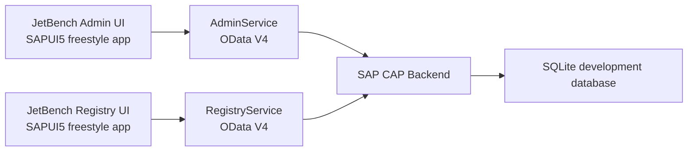

# JetBench

JetBench is a lightweight aircraft maintenance and fleet registry application built as a personal SAP CAP and Fiori practice project. The product concept is aimed at small jet and turboprop operators, individual aircraft owners, and maintenance shops that need practical maintenance visibility without the cost and complexity of large enterprise aviation maintenance platforms.

The first MVP focus is fleet and engine health management: organizations, users, aircraft, engines, models, operating status, and the basic administrative structure needed to support future maintenance tracking workflows.

## Why This Project Exists

Small aviation operators often need only a focused subset of maintenance software functionality. Full-scale systems can be expensive, operationally heavy, and more complex than what a small shop or owner-operator needs day to day.

JetBench explores a lighter alternative:

- Keep the data model small enough to understand and maintain.
- Focus on aircraft and engine records before expanding into full maintenance tracking.
- Support multi-organization usage from the beginning.
- Use SAP-style architecture and Fiori patterns to practice real enterprise application development.

This project is also intended as a portfolio piece for SAP roles, especially around CAP, OData, Fiori/UI5, domain modeling, and business application design.

## Current Scope

Implemented or in progress:

- Organization management
- User management
- Aircraft and engine registry
- Aircraft and engine model master data
- OData V4 services for admin and registry use cases
- Fiori/UI5 freestyle applications
- CAP CDS domain model with associations, enums, code lists, and value-help style annotations
- Seed data for local development

Planned future scope:

- Engine health monitoring entries and trend data
- Maintenance events and compliance tracking
- Airframe maintenance tracking
- Document references for maintenance records
- Role-based authorization improvements
- Dashboard and reporting views

## Architecture



## Main Domain Model

The core entities are intentionally simple and operational:

- `Organization`: tenant/operator record with type, country, status, and primary contact.
- `AppUser`: user assigned to an organization with a platform or organization role.
- `AircraftModel`: aircraft type/master data.
- `EngineModel`: engine type/master data including TBO.
- `Aircraft`: aircraft record linked to an organization and model.
- `Engine`: engine record linked to an organization, model, and optionally an aircraft.

Code-list entities provide backend-owned labels for select fields such as organization type, organization status, and user role.

## Applications

### Admin App

Located at:

```text
fiori-frontend/apps/admin
```

Purpose:

- Manage organizations
- Manage users
- Manage aircraft and engine registry data
- Demonstrate admin-oriented Fiori navigation and forms

### Registry App

Located at:

```text
fiori-frontend/apps/registry
```

Purpose:

- Provide registry-focused views over aircraft and engine data
- Separate operational registry workflows from platform administration

### CAP Backend

Located at:

```text
cap-backend
```

Services:

- `AdminService`: users, organizations, aircraft, engines, models, and value lists.
- `RegistryService`: organization-restricted aircraft and engine registry projections.

## Technology Stack

- SAP Cloud Application Programming Model CAP
- CDS domain modeling
- OData V4
- SAPUI5 / OpenUI5 freestyle apps
- TypeScript controllers
- SQLite for local development
- UI5 Tooling

## Local Development

Install dependencies in each project folder:

```powershell
cd cap-backend
npm install

cd ..\fiori-frontend\apps\admin
npm install

cd ..\registry
npm install
```

Deploy local seed data:

```powershell
cd cap-backend
npx cds deploy --to sqlite
```

Start the CAP backend:

```powershell
cd cap-backend
npm start
```

Start a frontend app:

```powershell
cd fiori-frontend\apps\admin
npm start
```

or:

```powershell
cd fiori-frontend\apps\registry
npm start
```

Build a frontend app:

```powershell
npm run build
```

Validate the CAP model:

```powershell
cd cap-backend
npx cds compile db srv
```

## SAP Learning Goals

This project is designed to demonstrate and practice:

- CAP entity modeling and service projections
- OData V4 service consumption from SAPUI5
- Fiori-style list/detail navigation
- UI5 routing, controllers, and XML views
- Value lists and backend-owned select options
- Multi-tenant-style data separation through organization ownership
- Practical enterprise CRUD flows with validation and seed data

## Product Direction

JetBench is not intended to become a full enterprise maintenance system immediately. The product direction is deliberately lean:

1. Build a reliable fleet and engine registry.
2. Add engine health monitoring records and trend visibility.
3. Add maintenance events and compliance status.
4. Expand into airframe maintenance tracking.
5. Keep the interface simple enough for small operators and shops.

## Status

This is an active personal project and learning sandbox. It is not production-ready, but the current direction is meant to show how a real aviation maintenance product could be modeled and built with SAP technologies.
