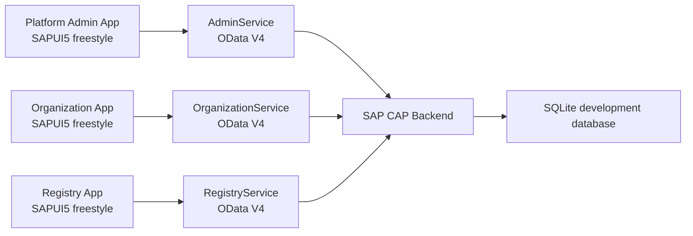

# JetBench

JetBench is an Engine Health Monitoring platform for small to medium aviation operators that need a practical way to track engine status, aircraft assignments, utilization, and supporting fleet data.

The application is built around the engine as the primary asset. Organizations can maintain their aircraft and engine records, assign engines to aircraft, monitor operating status, and keep the core data needed for future engine-health trends, dashboards, and reports.

## Product Focus

JetBench is designed to help operators answer engine-health questions such as:

- Is this engine performing as expected for its current operating hours and cycles?
- Are recorded parameters staying within expected limits?
- Is the engine showing early signs of degradation or abnormal behavior?
- Should this engine be inspected before its next planned maintenance interval?
- How is engine condition changing over time?
- Which engines need attention first?

Aircraft assignments, organization records, users, and model data provide the operational context for those answers. The core purpose of JetBench is to turn engine records and operating data into useful engine-health visibility.

## Current Capabilities

- Platform-level organization and user administration
- Organization-scoped user, aircraft, and engine management
- Aircraft and engine registry views
- Aircraft and engine model master data
- Engine assignment to aircraft
- Engine operating status tracking
- Aircraft and engine utilization fields
- Role-based service access
- Organization-scoped data isolation
- SAP CAP OData V4 backend services
- SAPUI5/OpenUI5 freestyle frontend applications
- Local seed data and backend tests

## Planned Engine Health Monitoring Capabilities

The next product layer will focus on engine-health workflows, including:

- engine condition entries
- engine trend data
- engine utilization history
- engine health dashboards
- engine-focused reports
- alerts for engines requiring attention

## Architecture



## Domain Model

The current domain model establishes the operational structure for engine monitoring:

- `Organization`: aviation operator or customer account used for data ownership and isolation.
- `AppUser`: user assigned to an organization with a platform or organization role.
- `AircraftModel`: aircraft type/master data.
- `EngineModel`: engine type/master data, including TBO.
- `Aircraft`: aircraft record owned by an organization.
- `Engine`: engine record owned by an organization and optionally assigned to an aircraft.

## Applications

### Platform Admin App

Located at:

```text
fiori-frontend/apps/admin
```

Purpose:

- Manage platform-wide organizations, users, aircraft, engines, and model data.
- Provide platform administrators with visibility across all organizations.

Backend service:

```text
/odata/v4/admin/
```

### Organization App

Located at:

```text
fiori-frontend/apps/organization
```

Purpose:

- Allow organization administrators to manage their own users, aircraft, and engines.
- Keep customer-side data scoped to the authenticated user’s organization.
- Provide the main administration surface for engine monitoring data.

Backend service:

```text
/odata/v4/organization/
```

### Registry App

Located at:

```text
fiori-frontend/apps/registry
```

Purpose:

- Provide read-oriented visibility into organization-scoped aircraft and engine data.
- Support users who need fleet and engine visibility without platform administration access.

Backend service:

```text
/odata/v4/registry/
```

## CAP Backend

Located at:

```text
cap-backend
```

Services:

- `AdminService`: platform-wide administration service.
- `OrganizationService`: organization-scoped administration service.
- `RegistryService`: organization-scoped read service for aircraft and engine registry data.

## Technology Stack

- SAP Cloud Application Programming Model CAP
- CDS domain modeling
- OData V4
- SAPUI5 / OpenUI5 freestyle apps
- TypeScript controllers
- SQLite for local development
- UI5 Tooling

## Local Development

Install backend dependencies:

```powershell
cd cap-backend
npm install
```

Install frontend dependencies as needed:

```powershell
cd fiori-frontend\apps\admin
npm install

cd ..\organization
npm install

cd ..\registry
npm install
```

Start the CAP backend:

```powershell
cd cap-backend
npx cds serve --in-memory
```

Start a frontend app:

```powershell
cd fiori-frontend\apps\organization
npm run start
```

Build a frontend app:

```powershell
npm run build
```

Validate the CAP model:

```powershell
cd cap-backend
npx cds compile db srv
```

Run backend tests:

```powershell
cd cap-backend
npm test
```

## Status

JetBench is under active development. The current implementation provides the organizational, fleet, and engine data foundation for the Engine Health Monitoring workflows that will be added next.

