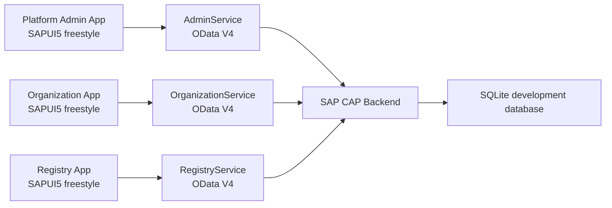

# JetBench

JetBench is a focused Engine Health Monitoring application built as a personal SAP CAP and Fiori learning project.

The current product scope is intentionally narrow: help aviation organizations track engines, their aircraft assignments, operating status, usage totals, and the supporting master data needed for engine-health workflows.

Organization, user, aircraft, and engine management are included because they provide the operational structure around engine monitoring. They are supporting capabilities, not a signal that JetBench is intended to be a full aircraft maintenance platform.

## Current Scope

JetBench currently focuses on:

- Organization management
- User management
- Aircraft registry data
- Engine registry data
- Aircraft and engine model master data
- Organization-scoped access for customer users
- Platform-wide access for platform administrators
- Fiori/UI5 applications for platform and organization workflows
- SAP CAP OData V4 services
- Local seed data for development and testing

The product direction from here is Engine Health Monitoring:

- engine condition/status visibility
- engine utilization tracking
- engine trend data
- engine-focused dashboards and reports
- engine records scoped to the correct organization

## What This Project Is Not

JetBench is not currently scoped as a full aircraft maintenance, compliance, work-order, or flight-operations platform.

Aircraft and organization records exist to support engine monitoring. The goal is to keep the application small enough to reason about while still practicing realistic enterprise patterns.

## Architecture



## Main Domain Model

The current domain model provides the foundation for engine monitoring:

- `Organization`: customer/operator record used for organization-level data isolation.
- `AppUser`: application user assigned to an organization and role.
- `AircraftModel`: aircraft type/master data.
- `EngineModel`: engine type/master data including TBO.
- `Aircraft`: aircraft record linked to an organization and model.
- `Engine`: engine record linked to an organization, model, and optionally an aircraft.

## Applications

### Platform Admin App

Located at:

```text
fiori-frontend/apps/admin
```

Purpose:

- Used by platform administrators.
- Provides platform-wide visibility across organizations.
- Manages organizations, users, aircraft, engines, and model data.

Backend service:

```text
/odata/v4/admin/
```

### Organization App

Located at:

```text
fiori-frontend/apps/organization
```

Purpose:

- Used by organization administrators.
- Manages only the current organization’s users, aircraft, and engines.
- Provides the customer-side administration surface for engine monitoring data.

Backend service:

```text
/odata/v4/organization/
```

### Registry App

Located at:

```text
fiori-frontend/apps/registry
```

Purpose:

- Provides read-oriented views over organization-scoped aircraft and engine data.
- Supports basic operational visibility without exposing platform administration.

Backend service:

```text
/odata/v4/registry/
```

## CAP Backend

Located at:

```text
cap-backend
```

Services:

- `AdminService`: platform-wide administration service.
- `OrganizationService`: organization-scoped administration service.
- `RegistryService`: organization-scoped read service for aircraft and engine registry data.

## Technology Stack

- SAP Cloud Application Programming Model CAP
- CDS domain modeling
- OData V4
- SAPUI5 / OpenUI5 freestyle apps
- TypeScript controllers
- SQLite for local development
- UI5 Tooling

## Local Development

Install backend dependencies:

```powershell
cd cap-backend
npm install
```

Install frontend dependencies as needed:

```powershell
cd fiori-frontend\apps\admin
npm install

cd ..\organization
npm install

cd ..\registry
npm install
```

Start the CAP backend:

```powershell
cd cap-backend
npx cds serve --in-memory
```

Start a frontend app:

```powershell
cd fiori-frontend\apps\organization
npm run start
```

Build a frontend app:

```powershell
npm run build
```

Validate the CAP model:

```powershell
cd cap-backend
npx cds compile db srv
```

Run backend tests:

```powershell
cd cap-backend
npm test
```

## SAP Learning Goals

This project is designed to practice:

- CAP entity modeling and service projections
- OData V4 service consumption from SAPUI5
- Fiori-style list/detail navigation
- UI5 routing, controllers, and XML views
- Role-based service boundaries
- Organization-scoped data access
- Practical enterprise CRUD flows
- Seed data and backend tests

## Status

This is an active personal learning project and is not production-ready.

The current direction is to build a clean, focused Engine Health Monitoring application with SAP CAP and Fiori.
